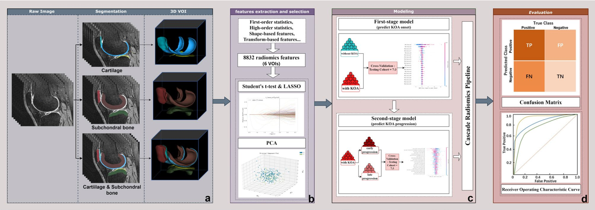
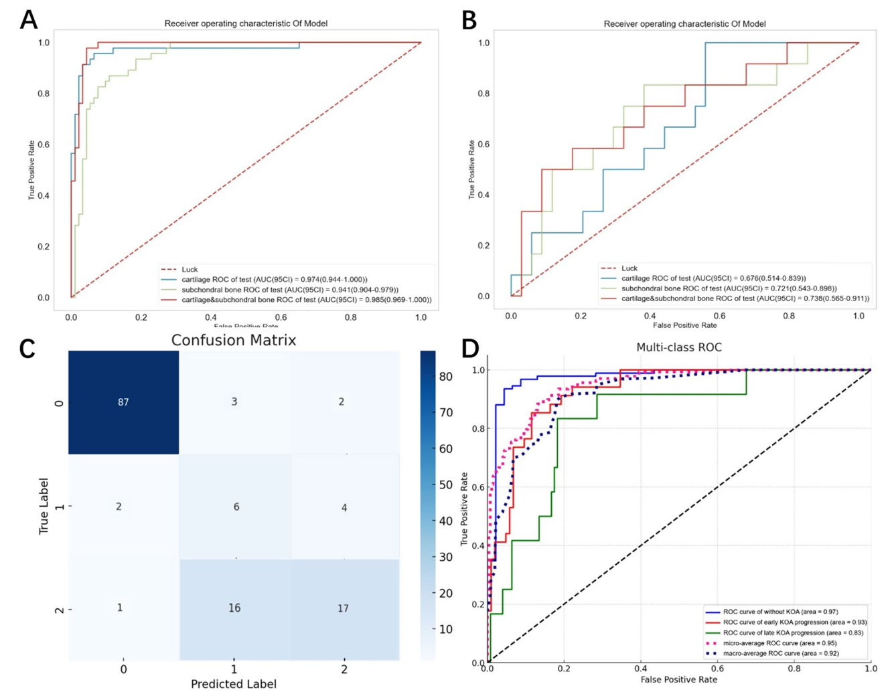

# MRI-based Radiomics Framework for Early Knee Osteoarthritis

This repository accompanies the following publication:

> **Fu J**, Mu L, Dong D, *et al.*  
> **An MRI-based radiomics framework for early identification and progression stratification in knee osteoarthritis: data from the osteoarthritis initiative.**  
> *BMC Musculoskeletal Disorders*. 2025;26:1018.  
> DOI: 10.1186/s12891-025-09234-2

If you would like to obtain the curated dataset used in this study, please contact: **<549936583@qq.com>**.

---

## Overview

This work proposes an MRI-based radiomics framework to:

1. **Identify individuals at high risk of incident knee osteoarthritis (KOA)** before radiographic changes appear (baseline KL 0–1); and  
2. **Stratify the speed of disease progression** into early vs. late progressors once KOA develops.

Using sagittal 3D DESS MRI from the Osteoarthritis Initiative (OAI), we:

- Segment **cartilage and subchondral bone** of the femur, tibia, and patella with an nnU-Net–based model plus expert refinement.
- Extract high-dimensional radiomic features (first-order, shape, texture, and filter-based) from six 3D VOIs.
- Perform feature stability filtering (ICC ≥ 0.75), univariate tests, LASSO, and PCA for dimensionality reduction.
- Build a **two-stage logistic regression (LR) pipeline**:
  1. Stage 1: predict 4-year **incident radiographic KOA** (KL ≥ 2) vs. non-KOA.
  2. Stage 2: among incident KOA cases, distinguish **early progressors** (≤ 2 years) from **late progressors** (> 2 years).
- Cascade the two LR models into a **three-class classifier**:  
  **no KOA / early progressor / late progressor**.

In the independent test cohort, the combined **cartilage + subchondral bone** radiomics model achieved:

- **AUC = 0.985** for predicting KOA incidence within 4 years.  
- **AUC = 0.738** for stratifying early vs. late progression.  
- **Micro-averaged AUC = 0.948** and overall accuracy **0.791** for the three-class cascaded framework.

These results suggest that joint modeling of cartilage and subchondral bone radiomics can enhance early KOA risk stratification and support timely clinical decision-making.

---

## Key Figures

### 1. Study cohort and radiomics workflow



*Figure 1. Study cohort selection and cascaded MRI-based radiomics pipeline. All participants are drawn from the Osteoarthritis Initiative (OAI) with baseline KL 0–1. After applying inclusion/exclusion criteria and propensity score matching, sagittal 3D DESS MRI of the right knee are used for nnU-Net–based segmentation of femoral, tibial, and patellar cartilage and subchondral bone. Radiomic features are extracted and selected, followed by a two-stage logistic regression framework to predict incident KOA and stratify early vs. late progressors.*

### 2. Model performance and cascaded classification



*Figure 2. Receiver operating characteristic (ROC) curves for predicting KOA incidence and progression, along with the confusion matrix and multi-class ROC of the cascaded three-class classifier. The combined cartilage + subchondral bone model shows high discrimination for incident KOA and clinically meaningful separation of early vs. late progressors.*

> **Licensing note:** These figures are reproduced from the published article in *BMC Musculoskeletal Disorders* under the Creative Commons Attribution–NonCommercial–NoDerivatives 4.0 (CC BY-NC-ND 4.0) license. Please provide appropriate credit to the original authors and journal when using them.

---

## Citation

If you use this repository, code, or dataset in your research, please cite:

```bibtex
@article{Fu2025KOA_radiomics,
  title   = {An MRI-based radiomics framework for early identification and progression stratification in knee osteoarthritis: data from the osteoarthritis initiative},
  author  = {Fu, Jiahui and Mu, Lin and Dong, Dong and Li, Mingyang and Miao, Zheng and Huai, Xiaochen and Zheng, Yuhao and Zhang, Huimao},
  journal = {BMC Musculoskeletal Disorders},
  year    = {2025},
  volume  = {26},
  pages   = {1018},
  doi     = {10.1186/s12891-025-09234-2}
}
